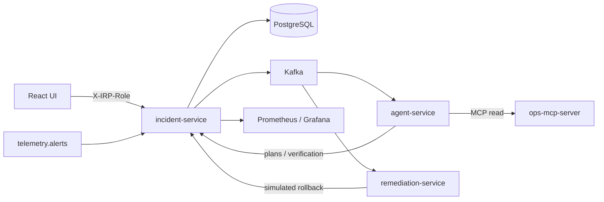

# Autonomous Incident Response Platform

[](https://github.com/axshatj/incident-response-platform/actions/workflows/ci.yml)

Production-style AI platform that detects, investigates, diagnoses, and safely remediates distributed-system incidents using event-driven Java services, observability data, RAG, MCP, and policy-controlled AI agents.

## Documentation

| Document | Purpose |
|----------|---------|
| [SKILL.md](SKILL.md) | Cursor Agent Skill — directives, guardrails, build order, MVP |
| [reference/architecture.md](reference/architecture.md) | System architecture, telemetry, Kafka, data model, infra |
| [reference/ai-agents.md](reference/ai-agents.md) | Agent schemas, MCP tools, RAG, evaluation |
| [reference/safety-and-security.md](reference/safety-and-security.md) | Remediation policy, executor contract, security model |
| [reference/threat-model.md](reference/threat-model.md) | STRIDE-lite threat model for the MVP control plane |

## Core Principle

**AI reasons and investigates. Deterministic software controls execution.**

The LLM never executes shell, `kubectl`, SQL, or cloud API calls directly.

## Status — Phase 9

Delivered:

- Incident Service (Spring Boot 3, Java 21) with immutable state-machine + audit trail
- PostgreSQL 16 + **pgvector** via Docker Compose
- REST API (`/api/incidents/*`, `/api/knowledge/search`, remediation plan/execution, verification) and React dashboard
- **Header RBAC** (`X-IRP-Role` / `X-IRP-Actor`) + in-memory rate limit on the public API; AGENT cannot approve
- **OpenTelemetry instrumentation** (Micrometer Tracing → OTLP) with trace/span propagation
- **JSON structured logs** with `traceId` / `spanId` correlated to Jaeger
- **Custom domain metrics** for lifecycle, eventing, RAG, MCP, remediation, verification, and LLM/tool calls
- **Observability stack**: OTel Collector, Prometheus, Jaeger, Grafana (incident + agent dashboards)
- **Kafka (KRaft) + Kafka UI** for event-driven processing
- **Alert-driven ingestion**: `telemetry.alerts` → `AlertConsumer` → incident + `incident.detected` published
- **Retries + DLT**: `DefaultErrorHandler` with `FixedBackOff(2s, 3)` → `telemetry.alerts.DLT`
- **Idempotent consumer** via `alertId` → `external_id` unique constraint
- **Agent service**: Spring AI ChatClient + schema-validated Triage / Investigation / RCA / Remediation plan / Verification
- **Ops MCP server**: JSON-RPC `initialize` / `tools/list` / `tools/call` over HTTP; read-only allowlist (no shell / kubectl)
- **MCP client** in agent-service: tools are invoked remotely, not in-process
- **RAG**: seeded runbooks / architecture / past incidents / policies; hybrid retrieve (hash embeddings + metadata filter + top-K snippets)
- **Policy engine**: LOW auto-execute, HIGH requires approval, CRITICAL prohibited
- **Remediation service**: deterministic simulated Kubernetes rollback with namespace/deployment/revision allowlists and idempotency keys
- **Verification**: recovery overlay on successful execution, auto-resolve, bounded retry (`irp.verification.max-attempts`, default 2), then escalate for human resolve
- **Eval suite** (`@Tag("eval")`) for tool allowlists, RCA keywords, unsafe-action refusal, verification schema — run in CI
- **Stub LLM** by default so the MVP path runs without an API key
- Dashboard shows observations, cited knowledge, proposed rollback, execution audit, verification, and a demo role picker

The nine-phase MVP is complete. Production OIDC belongs in front of incident-service, not inside the agent.

## Architecture



## Quickstart

Prerequisites: Docker Desktop, Node 20+, Java 21+ (only if building without Docker).

```bash
# 1. Start the whole stack (Postgres+pgvector, incident-service, agent-service, ops-mcp-server, OTel, Prometheus, Jaeger, Grafana, Kafka)
docker compose -f infra/docker-compose.yml up --build

# 2. In another terminal, start the UI
cd ui
npm install
npm run dev
```

If you previously ran Compose with `postgres:16-alpine`, recreate the volume so Flyway can install pgvector (`down -v` wipes local demo data only):

```bash
docker compose -f infra/docker-compose.yml down -v
docker compose -f infra/docker-compose.yml up --build
```

Open http://localhost:5173. The Vite dev server proxies `/api/*` to the incident-service on port 8080.

The UI sends `X-IRP-Role` (default **APPROVER**) and `X-IRP-Actor`. Curl needs the same headers:

```bash
export IRP_AUTH='-H X-IRP-Role: APPROVER -H X-IRP-Actor: you'
```

Set `IRP_AUTH_ENABLED=false` only for throwaway local scripts. See [reference/threat-model.md](reference/threat-model.md).

### Tool URLs

| Tool | URL | What to look at |
|------|-----|-----------------|
| Dashboard UI | http://localhost:5173 | Incident list, detail, timeline, lifecycle actions |
| Incident API | http://localhost:8080 | `/api/incidents`, `/api/knowledge/search`, `/actuator/health`, `/actuator/prometheus` |
| Grafana | http://localhost:3000 | IRP → **Incident Service — Overview** and **Agent Service — AI observability** |
| Prometheus | http://localhost:9090 | Query `irp_incident_transitions_total`, `irp_agent_llm_total`, `irp_verification_outcome_total` |
| Jaeger | http://localhost:16686 | Service = `incident-service`, look for `incident.create` / `incident.transition` spans |
| Kafka UI | http://localhost:8090 | Cluster `irp` — inspect topics `telemetry.alerts`, `incident.detected`, `incident.updated`, `telemetry.alerts.DLT` |
| Agent API | http://localhost:8081 | `/actuator/health` — consumes `incident.detected` and writes investigation artifacts |
| Ops MCP | http://localhost:8082 | `GET /mcp/tools`, `POST /mcp` JSON-RPC (`tools/list`, `tools/call`) |
| Remediation API | http://localhost:8083 | `/actuator/health` — executes approved rollbacks |

### Generate traffic to light up the dashboard

```bash
# Loop: create an incident, then walk it partway to trigger both a legal and an illegal transition
for i in {1..10}; do
  ID=$(curl -sS -X POST http://localhost:8080/api/incidents \
    -H "Content-Type: application/json" $IRP_AUTH \
    -d '{"service":"payment-service","title":"DB pool saturated","severity":"SEV2","environment":"prod"}' \
    | jq -r .id)
  curl -sS -X POST "http://localhost:8080/api/incidents/$ID/acknowledge" \
    -H "Content-Type: application/json" $IRP_AUTH -d '{"actor":"loadgen"}' >/dev/null
  # Illegal jump (TRIAGING -> RESOLVED) -> increments irp_incident_illegal_transitions_total
  curl -sS -X POST "http://localhost:8080/api/incidents/$ID/resolve" \
    -H "Content-Type: application/json" $IRP_AUTH -d '{"actor":"loadgen"}' >/dev/null
done
```

### Inject an alert via Kafka (Phase 3)

The `telemetry.alerts` topic is the canonical ingestion path — the same one a real Alertmanager/webhook bridge would use.

```bash
# 1. Open a producer shell inside the kafka container
docker exec -it irp-kafka \
  kafka-console-producer.sh --broker-list localhost:9092 --topic telemetry.alerts

# 2. Paste one line of JSON (envelope + payload) and press Enter:
{"eventId":"11111111-1111-1111-1111-111111111111","eventType":"telemetry.alert","schemaVersion":1,"timestamp":"2026-09-16T20:00:00Z","correlationId":"am-42","source":"alertmanager","payload":{"alertId":"am-42","service":"payment-service","title":"DB pool exhausted","description":"p99 > 2s after v42","severity":"SEV2","environment":"prod","labels":{"region":"us-east-1"}}}
```

Within a second you should see:

- A new incident with `externalId=am-42` on the dashboard
- An `incident.detected` message on that topic (visible in Kafka UI)
- Counter `irp_alerts_consumed_total{result="created"}` incremented in Prometheus
- Sending the same line again increments `irp_alerts_consumed_total{result="duplicate"}` and does **not** create a second incident (idempotent via `external_id`)
- The agent-service consumes `incident.detected`, runs triage + bounded tools + RAG + RCA + a **rollback proposal**, and leaves the incident in `AWAITING_APPROVAL` (HIGH risk)
- Retrieved runbooks appear as **Cited knowledge** observations on the incident detail page

To exercise the DLT: send a malformed line (e.g. `{"eventType":"telemetry.alert"}`) — it will retry 3× then land in `telemetry.alerts.DLT`.

### Search the knowledge base (Phase 5)

```bash
curl -sS $IRP_AUTH "http://localhost:8080/api/knowledge/search?query=payment-service%20hikari%20postgres%20pool&service=payment-service&topK=3"
```

Expect the payment-service DB-pool runbook and `INC-2025-0412` near the top, not the Kafka consumer-lag note.

### Call ops tools via MCP (Phase 6)

```bash
curl -sS http://localhost:8082/mcp/tools
curl -sS http://localhost:8082/mcp \
  -H "Content-Type: application/json" \
  -d '{"jsonrpc":"2.0","id":1,"method":"tools/call","params":{"name":"query_metrics","arguments":{"service":"payment-service"}}}'
# shell / kubectl are rejected:
curl -sS http://localhost:8082/mcp \
  -H "Content-Type: application/json" \
  -d '{"jsonrpc":"2.0","id":2,"method":"tools/call","params":{"name":"shell","arguments":{"service":"payment-service"}}}'
```

### Approve a rollback (Phase 7)

After an alert-driven investigation the dashboard shows a `ROLLBACK_DEPLOYMENT` plan at risk **HIGH**. Approve it:

```bash
curl -sS -X POST "http://localhost:8080/api/incidents/<id>/approve" \
  -H "Content-Type: application/json" $IRP_AUTH -d '{"actor":"you","note":"approved rollback to r41"}'
```

The remediation-service then performs a simulated Kubernetes rollback (`prod/payment-service` 42 → 41) and the incident moves to `VERIFYING`. `SHELL` / `DROP_DATABASE` proposals are rejected with HTTP 403 before any executor runs.

### Auto-verify recovery (Phase 8)

Agent-service consumes `incident.updated` when `toStatus=VERIFYING` after `REMEDIATION_EXECUTED`. It overlays the successful rollback on (possibly stale) MCP snapshots and posts a verification result. incident-service will **not** mark `RESOLVED` unless a `SUCCEEDED` execution exists.

```bash
curl -sS $IRP_AUTH "http://localhost:8080/api/incidents/<id>/verification"
```

If verification returns `NOT_RESOLVED`, the incident loops to `INVESTIGATING` at most `irp.verification.max-attempts` times (default 2), then stays in `VERIFYING` with a `VERIFICATION_ESCALATED` audit event for a human `Resolve`.

### Agent evaluation (Phase 9)

```bash
./mvnw -pl services/incident-service,services/agent-service -am test -Dgroups=eval
```

The suite checks tool allowlists, RCA keywords for the DB-exhaustion scenario, refusal of `SHELL` / `DROP_DATABASE`, verification schema, and role separation (AGENT cannot approve). CI runs the same tag after `verify`.

### Event topics

| Topic | Direction | Purpose |
|-------|-----------|---------|
| `telemetry.alerts` | in | Monitoring systems publish alert envelopes here |
| `telemetry.alerts.DLT` | in (dead-letter) | Records that failed 4 processing attempts |
| `incident.detected` | out | Emitted when a new incident is opened (agent-service consumes this) |
| `incident.updated` | out | Emitted on every lifecycle transition |
| `investigation.requested` | out | Reserved for explicit re-investigation |
| `investigation.completed` | out | Reserved for agent completion events |

### Verify the backend directly

```bash
# Create an incident
curl -X POST http://localhost:8080/api/incidents \
  -H "Content-Type: application/json" $IRP_AUTH \
  -d '{
        "service": "payment-service",
        "title": "DB connection exhaustion",
        "description": "Pool saturated after v42 deploy",
        "severity": "SEV2",
        "environment": "prod"
      }'

# List incidents
curl $IRP_AUTH http://localhost:8080/api/incidents

# Acknowledge (DETECTED -> TRIAGING)
curl -X POST http://localhost:8080/api/incidents/<id>/acknowledge \
  -H "Content-Type: application/json" $IRP_AUTH -d '{"actor":"you"}'
```

### Local dev without Docker

```bash
# Start only Postgres+pgvector (traces will silently fail to export - that's fine)
docker compose -f infra/docker-compose.yml up postgres -d

# Run the service directly (uses the default profile: plain console logs)
export JAVA_HOME=/path/to/jdk-21   # Windows: $env:JAVA_HOME = "..."
./mvnw -pl services/incident-service spring-boot:run
```

## Repository Layout

```
incident-response-platform/
├── SKILL.md, reference/            # Engineering skill and design references
├── pom.xml                         # Parent Maven multi-module
├── mvnw, mvnw.cmd, .mvn/           # Maven wrapper
├── services/
│   ├── incident-service/           # Lifecycle, Kafka consumers, investigation store, RAG, policy
│   ├── agent-service/              # Spring AI triage + investigation (stub LLM by default)
│   ├── ops-mcp-server/             # Read-only Incident Operations MCP (JSON-RPC over HTTP)
│   └── remediation-service/        # Deterministic Kubernetes executor (simulated cluster)
├── ui/                             # React dashboard (Vite + TS + Tailwind)
└── infra/
    ├── docker-compose.yml          # Full local stack
    ├── otel/                       # OTel Collector config
    ├── prometheus/                 # Prometheus scrape config
    └── grafana/                    # Datasource + dashboard provisioning
```

## Kafka event model

Every message uses the canonical envelope from [`SKILL.md`](SKILL.md) and
[`reference/architecture.md`](reference/architecture.md):

```json
{
  "eventId": "uuid",
  "eventType": "telemetry.alert",
  "schemaVersion": 1,
  "timestamp": "2026-09-16T20:00:00Z",
  "correlationId": "am-42",
  "source": "alertmanager",
  "payload": { "...": "type-specific" }
}
```

The `correlationId` becomes the Kafka message key so all messages about a
single alert / incident land on the same partition and preserve order.

## Tech Stack

Java 21 · Spring Boot 3 · Spring AI · PostgreSQL + pgvector · Kafka · Redis · OpenSearch · OpenTelemetry · Kubernetes · Prometheus · Grafana · React (Vite + TS + Tailwind)

See the [build order](SKILL.md#build-order-do-not-skip-ahead) in `SKILL.md` for what each phase delivers.
